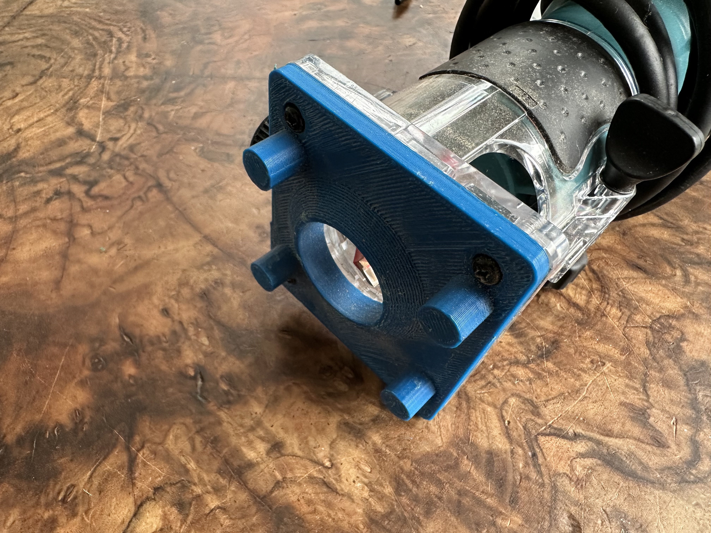
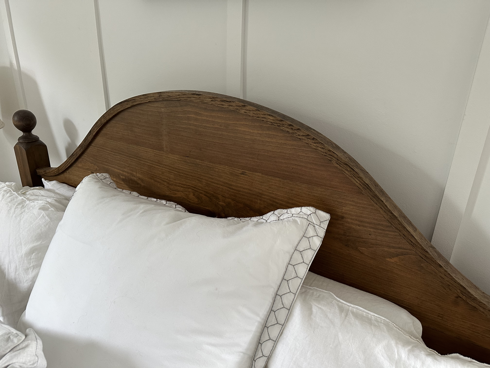

# Router Jig

This is a jig for a [Makita 3709
1/4" Fixed Base Laminate Trimmer](https://www.makitatools.com/products/details/3709). The jig is designed to ride along a 1.5" board, which was steam-formed to an arcing shape to serve as trim on an arcing headboard. We used the jig to route a slot into the board, so that it would hold the headboard panel. The board had to be shaped before routing; the routed board split too much during shaping.

The guide was adequate. It would have worked better with narrower margin (less slop) around the board.

